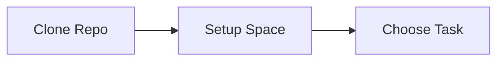
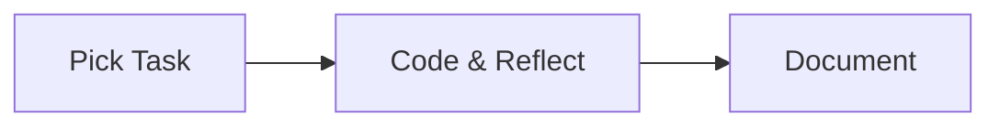
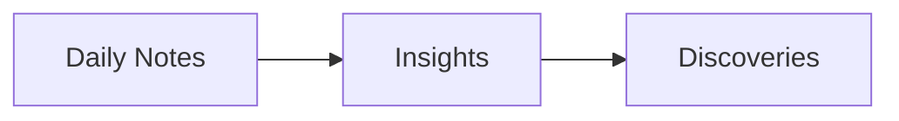
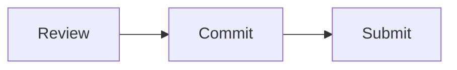

# Cultural Coding Probes 🔍

## Your Journey Path 🗺️

### 1️⃣ Start Here (15 min)

📂 `01_start_here/`
- 📝 Quick setup guide
- ⚙️ Environment check
- 🎯 Task selection

### 2️⃣ Your Task (30-60 min)

📂 `02_your_task/`
- 🐛 Bug fixing
- ✨ Feature development
- 🔄 Code review

### 3️⃣ Reflection (20 min)

📂 `03_reflection/`
- 📓 Developer diary
- 💭 Thought process
- 🎨 Visual thinking

### 4️⃣ Submission (10 min)

📂 `04_submission/`
- ✅ Checklist
- 🚀 Submit guide
- 📬 Follow-up

## Quick Start ⚡

1. Clone & Setup
```bash
git clone [repo-url]
cd cultural-probes
./01_start_here/setup.sh
```

2. Follow the Numbers
- Start at `01_start_here/`
- Move through each numbered folder
- Each step builds on the previous

## Need Help? 💁‍♀️

- 📖 Check `README.md` in each folder
- ❓ See `FAQ.md` for common questions
- 💬 Join our Discord
- 📧 Email support

## Privacy First 🔒

- Local data storage only
- You control what to share
- Anonymous submissions
- No tracking or metrics

---
Start your journey in `01_start_here/` 👋
